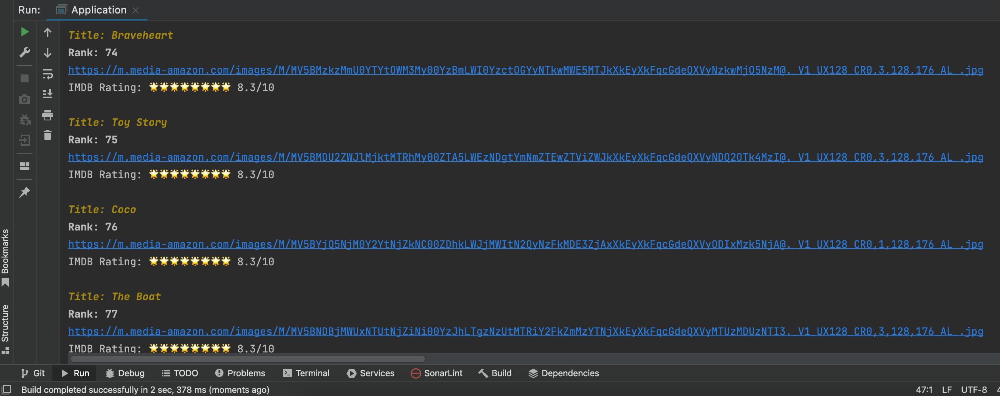
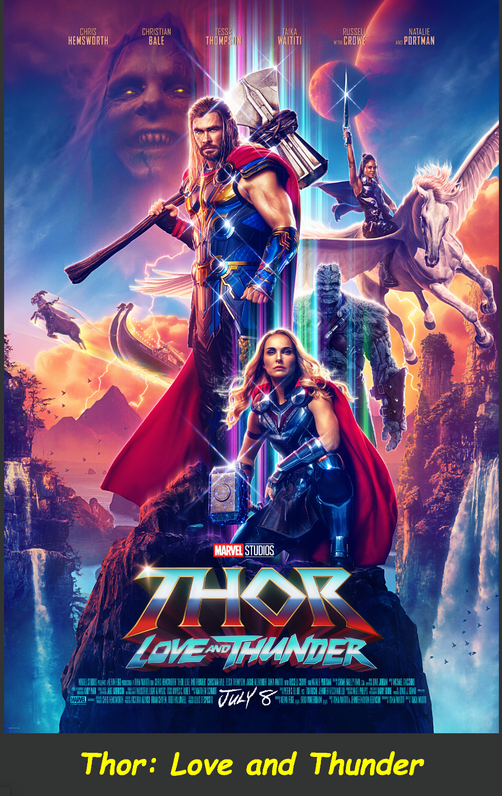

# imersao-java

Based on the content of the Immersion Course at https://www.alura.com.br/imersao-java
a Brazilian TI platform 

## First day: We have to create a httpRequest to consume IMDB API Top 250 Movies and Top Most popular movies nowdays

Doing the request to one of the endpoint's the result will be:

## Second day: Create sticker with the response did to one of endpoint:

We also have to write a string (something) bellow of the image created.
In my case I wrote the title of the movie.

## Third day: Apply Programming Orientation Object

On this day I have applied POO to the project refactoring some methods
